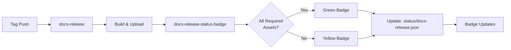

# Badge System

Dynamic status badges for documentation releases with completeness checking.

## Overview

The badge system provides real-time status indicators for documentation releases on GitHub, with intelligent completeness verification to ensure all required assets are present before showing a green badge.

## Quick Start

### Add Badge to README

```markdown
[](https://github.com/OWNER/REPO/releases/latest)
```

**Replace:** `OWNER/REPO` with your GitHub repository path

### Preview Badge Status

```bash
make badge_preview
```

---

## Badge States

| State | Color | Message | Meaning |
|-------|-------|---------|---------|
| **Passed** | 🟢 Green | `v2.0.10 — passed` | Release successful + all required assets present |
| **Incomplete** | 🟡 Yellow | `v2.0.10 — incomplete` | Release successful but missing required assets |
| **Failed** | 🔴 Red | `v2.0.10 — failed` | Release workflow failed |
| **Running** | 🟡 Yellow | `v2.0.10 — running` | Release in progress |
| **No Release** | ⚪ Gray | `no releases yet` | No releases published |

---

## Required Assets Configuration

### Method 1: Configuration File (Recommended)

**File:** `.github/required-assets.txt`

```
# One regex pattern per line (case-insensitive)
# Lines starting with # are comments

# At least one manual PDF with commit hash
.*manual.*_g[0-9a-f]{7,12}\.pdf$

# At least one appendix PDF with commit hash
.*appendix.*_g[0-9a-f]{7,12}\.pdf$

# Optional: two-up field cards
# .*TwoUp.*_g[0-9a-f]{7,12}\.pdf$
```

### Method 2: Repository Variable

Set a repository variable `SB_REQUIRED_ASSETS_PATTERNS`:

```
.*manual.*_g[0-9a-f]{7,12}\.pdf$
.*appendix.*_g[0-9a-f]{7,12}\.pdf$
```

**To set:**
1. Go to repository **Settings** → **Secrets and variables** → **Actions** → **Variables** tab
2. Click **New repository variable**
3. Name: `SB_REQUIRED_ASSETS_PATTERNS`
4. Value: Paste newline-separated regex patterns
5. Click **Add variable**

### Method 3: Default (Automatic)

If neither file nor variable exists, defaults to:
```
.*manual.*_g[0-9a-f]{7,12}\.pdf$
.*appendix.*_g[0-9a-f]{7,12}\.pdf$
```

---

## How It Works

### Workflow: `docs-release-status-badge.yml`

**Triggers:**
- After `docs-release` workflow completes
- Every 6 hours (cron schedule)
- Manual dispatch

**Process:**

1. **Load Requirements**
   - Priority: Repository variable → File → Defaults

2. **Evaluate Latest Release**
   - Get latest release from GitHub
   - List all asset names
   - Match each pattern against assets

3. **Determine Status**
   - Workflow succeeded + all assets → **Green** (passed)
   - Workflow succeeded + missing assets → **Yellow** (incomplete)
   - Workflow failed → **Red** (failed)
   - No release → **Gray** (no releases yet)

4. **Write Badge JSON**
   - Creates/updates `.status/docs-release.json`
   - Commits to main branch

5. **Badge Updates**
   - Shields.io endpoint reads the JSON
   - Badge reflects current status

---

## Badge JSON Format

**Location:** `.status/docs-release.json`

**Structure:**
```json
{
  "schemaVersion": 1,
  "label": "Docs Release",
  "message": "v2.0.10 — passed",
  "color": "brightgreen",
  "labelColor": "black",
  "link": "https://github.com/OWNER/REPO/releases/latest"
}
```

**Fields:**
- `label`: Badge label text
- `message`: Version + status
- `color`: Background color (brightgreen, yellow, red, lightgrey)
- `labelColor`: Label background
- `link`: Click destination

---

## Setup Instructions

### 1. Create Example Configuration

```bash
# Example file is already created
cat .github/required-assets.example.txt
```

### 2. Customize Requirements

```bash
# Copy example to active config
cp .github/required-assets.example.txt .github/required-assets.txt

# Edit to match your asset names
nano .github/required-assets.txt

# Commit
git add .github/required-assets.txt
git commit -m "docs: configure required release assets"
git push
```

### 3. Seed Initial Badge

```bash
# Create initial badge JSON
mkdir -p .status
cat > .status/docs-release.json <<'JSON'
{
  "schemaVersion": 1,
  "label": "Docs Release",
  "message": "no releases yet",
  "color": "lightgrey",
  "labelColor": "black"
}
JSON

git add .status/docs-release.json
git commit -m "ci(badge): seed initial docs-release badge"
git push
```

### 4. Add Badge to README

```markdown
## Status

[](https://github.com/OWNER/REPO/releases/latest)
```

### 5. Publish a Release

```bash
git tag v2.0.10
git push --tags
```

Badge will update automatically after release completes.

---

## Pattern Matching

### Regex Patterns

Patterns are JavaScript regular expressions matched **case-insensitively** against asset filenames.

**Examples:**

```
# Match any file with "manual" and commit hash
.*manual.*_g[0-9a-f]{7,12}\.pdf$

# Match specific filename
^SuperSonic_Manual_Dark_g[0-9a-f]{12}\.pdf$

# Match either dark or light manual
.*manual_(dark|light)_g[0-9a-f]{7,12}\.pdf$

# Match ZIP bundles
.*bundle.*_g[0-9a-f]{7,12}\.zip$

# Match split parts
.*bundle.*_g[0-9a-f]{7,12}\.zip\.part\d+$
```

### Common Patterns

**Commit-stamped PDFs:**
```
.*_g[0-9a-f]{7,12}\.pdf$
```

**Multiple alternatives:**
```
.*(manual|guide|handbook).*\.pdf$
```

**Specific name + commit:**
```
^SpecificFile_g[0-9a-f]{12}\.pdf$
```

**Any PDF:**
```
.*\.pdf$
```

---

## Testing Patterns

### Local Testing

```bash
# Create test asset list
cat > /tmp/assets.txt <<EOF
SuperSonic_Manual_Dark_ge05247101a22.pdf
SuperSonic_Manual_Light_ge05247101a22.pdf
Appendix_C_I2S_ge05247101a22.pdf
FieldCards_TwoUp_ge05247101a22.pdf
SonicBundle_ge05247101a22.zip
EOF

# Test pattern matching with Node.js
node -e '
const assets = require("fs").readFileSync("/tmp/assets.txt", "utf8").split("\n").filter(Boolean);
const patterns = [
  ".*manual.*_g[0-9a-f]{7,12}\\.pdf$",
  ".*appendix.*_g[0-9a-f]{7,12}\\.pdf$"
];

patterns.forEach(pat => {
  const re = new RegExp(pat, "i");
  const matches = assets.filter(a => re.test(a));
  console.log(`Pattern: ${pat}`);
  console.log(`Matches: ${matches.length > 0 ? matches : "NONE"}\n`);
});
'
```

### GitHub Actions Testing

1. Make a test release
2. Check workflow logs for asset evaluation:
   ```
   Workflow run → docs-release-status-badge → Evaluate required assets
   ```
3. Review outputs:
   - `has_all`: true/false
   - `missing`: JSON array of unmatched patterns
   - `assetsListed`: JSON array of all assets

---

## Troubleshooting

### Badge shows "incomplete" but all assets present

**Cause:** Pattern mismatch

**Debug:**
```bash
# Check actual asset names in latest release
gh release view --json assets --jq '.assets[].name'

# Compare with patterns
cat .github/required-assets.txt

# Test patterns locally (see Testing Patterns above)
```

### Badge not updating

**Cause 1:** Badge JSON not committed

**Solution:**
```bash
git pull
cat .status/docs-release.json
# Should show updated content
```

**Cause 2:** Shields.io cache

**Solution:** Wait 5 minutes or force refresh:
```
https://img.shields.io/endpoint?url=https://raw.githubusercontent.com/OWNER/REPO/main/.status/docs-release.json&cacheSeconds=0
```

### Badge shows "no releases yet" after publishing

**Cause:** Workflow hasn't run yet

**Solution:**
```bash
# Trigger manually
gh workflow run docs-release-status-badge.yml

# Or wait for cron schedule (runs every 6 hours)
```

### Pattern too strict

**Issue:** Badge always shows yellow (incomplete)

**Solution:** Relax pattern:
```
# Too strict (exact 12-char commit)
^Manual_g[0-9a-f]{12}\.pdf$

# More flexible (7-12 char commit, any prefix)
.*manual.*_g[0-9a-f]{7,12}\.pdf$
```

---

## Examples

### Example 1: Basic Setup

```bash
# .github/required-assets.txt
.*manual.*_g[0-9a-f]{7,12}\.pdf$
```

**Release assets:**
- ✅ `SuperSonic_Manual_Dark_ge05247101a22.pdf` → Matches
- ✅ `Manual_Light_ge052471.pdf` → Matches (7-char commit)
- ❌ `Guide.pdf` → No match (no commit hash)

**Result:** Green if manual present, yellow if missing

### Example 2: Multiple Requirements

```bash
# .github/required-assets.txt
.*manual.*_g[0-9a-f]{7,12}\.pdf$
.*appendix.*_g[0-9a-f]{7,12}\.pdf$
.*bundle.*_g[0-9a-f]{7,12}\.zip$
```

**Release assets:**
- ✅ `Manual_ge05247101a22.pdf`
- ✅ `Appendix_ge05247101a22.pdf`
- ✅ `Bundle_ge05247101a22.zip`

**Result:** Green (all 3 required assets present)

### Example 3: Optional Assets

```bash
# .github/required-assets.txt
# Required
.*manual.*_g[0-9a-f]{7,12}\.pdf$

# Optional (commented out)
# .*fieldcards.*_g[0-9a-f]{7,12}\.pdf$
```

**Release assets:**
- ✅ `Manual_ge05247101a22.pdf`

**Result:** Green (only manual required, field cards optional)

---

## Integration with CI/CD

### Complete Pipeline



### Workflow Dependencies

```yaml
# docs-release-status-badge.yml
on:
  workflow_run:
    workflows: ["docs-release"]  # Triggers after docs-release completes
    types: [completed]
```

---

## Best Practices

1. **Use commit-hash patterns**
   ```
   .*_g[0-9a-f]{7,12}\.pdf$
   ```
   Ensures assets are properly stamped

2. **Test patterns before committing**
   ```bash
   # Local testing with Node.js
   node -e 'console.log(/.*manual.*_g[0-9a-f]{7,12}\.pdf$/i.test("Manual_ge05247101a22.pdf"))'
   ```

3. **Document requirements in comments**
   ```
   # Core documentation (required)
   .*manual.*_g[0-9a-f]{7,12}\.pdf$
   
   # Supplementary appendix (required)
   .*appendix.*_g[0-9a-f]{7,12}\.pdf$
   
   # Optional field cards (commented out)
   # .*fieldcards.*_g[0-9a-f]{7,12}\.pdf$
   ```

4. **Version control badge JSON**
   ```bash
   git add .status/docs-release.json
   # Committed by workflow automatically
   ```

5. **Monitor badge status**
   ```bash
   make badge_preview
   ```

---

## Related Documentation

- **[MODULAR_BUILD_SYSTEM.md](MODULAR_BUILD_SYSTEM.md)** - Local build targets
- **[ARTIFACT_MANAGEMENT_SYSTEM.md](ARTIFACT_MANAGEMENT_SYSTEM.md)** - Asset preparation
- **[PDF_VERIFICATION_SYSTEM.md](PDF_VERIFICATION_SYSTEM.md)** - Metadata stamping

---

## Version History

- **v2.0.10** - Badge system with completeness checking
  - Required assets configuration
  - Pattern matching with regex
  - Yellow state for incomplete releases
  - Repository variable support
  - Local badge preview target
